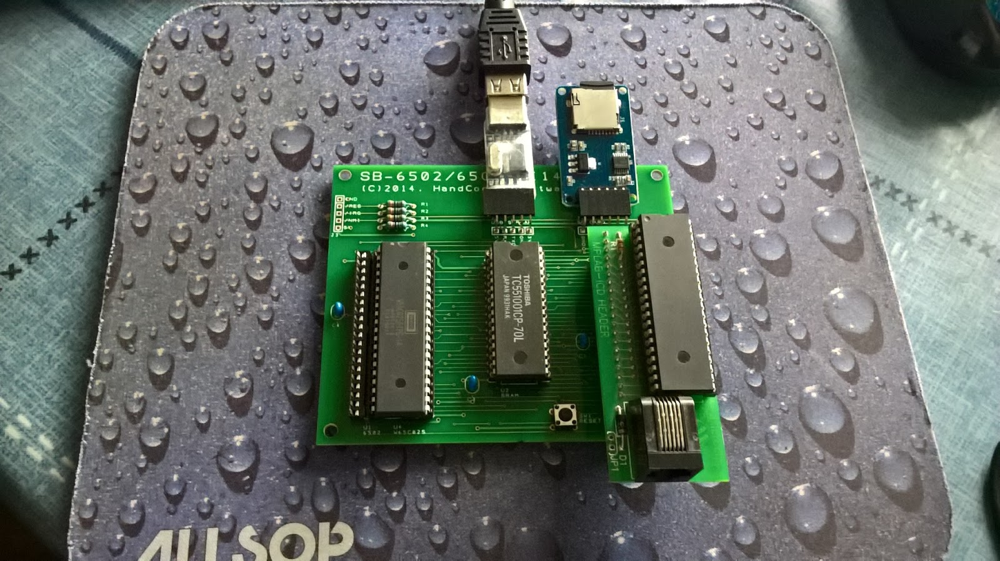

# SB-6502

This repository contains the firmware for a simple single board computer that uses only three chips, namely:

- A MOS 6502, WDC 65C02 or WDC 65C802 microprocessor
- A 128K SRAM memory chip (of which 64K is used)
- A 16F45K22 PIC micro-controller

The complete system, including a USB serial adapter and Micro SD card interface module, looks like this when assembled.



The board in the photo is a version 1 PCB and lacks a pull up on the /SO pin (not that it seems to matter to any of the processors). The PIC is also installed on a development daughter board which allows in circuit programming, normally its plugged straight into the PCB. A new version of the board is being manufactured. It is slightly smaller than 10cm x 10cm, includes an extra resistor and is black.

In order to make a working system the PIC must act as the source of the microprocessor's clock signal and decode it's control signals to either enable the memory or emulate a peripheral chip at the appropriate time.

## Booting a ROM-less System

Normally a microprocessor needs a ROM to hold the initial firmware that gets the system up and running. In this design the microprocessor does not have a ROM so we have to get the microprocessor to create one by feeding it fake instructions from the PIC.

The PIC generates a series of clock pluses while the microprocessor is released from reset. The microprocessor performs an interrupt sequence pushing a random PC value on the stack followed by the status flags. Then it reads the reset vector from $FFFC/D. The PIC provides data values back to the  microprocessor as if it was a ROM

### Telling the 6502, 65C02 and 65C802 Apart

The board is designed to take either a MOS 6502 or a WDC 65C02. A different socket is provided for each as some of the control signal pins differ between the two chips. A WDC 65C802 can also be used as it is pin compatible with the original 6502.

The PIC uses the fact that the 6502, 65C02 and 65C802 treat JMP ($FFFF) instructions differently. All will read the low byte of the target address from $FFFF but as 6502 reads the high byte from $FF00 while the 65C02 and 65C802 increment the address correctly and read from $0000 but take a different number of cycles to do so.

There are other ways you could tell the processors apart but this technique is easy to implement. The PIC feeds the microprocessor the jump indirect instruction when it resets and examines address bus values to see which memory address is accessed in each clock cycle.

### Loading the ROM

Once the PIC knows what type of microprocessor is installed it can generate the instructions needed to create an appropriate ROM image in the memory. The ROM is transferred by generating a pair of byte load and store instructions for each byte (e.g. LDA #$bb STA $addr). The PIC enables the SRAM chip during the cycle when the microprocessor writes the byte value to store it in the memory.

Every 256 bytes a JMP $1000 instruction is generated to reset the program counter to a lower value. When all of the image has been transferred a reset signal is generated to restart the microprocessor through the ROM's reset vector and the PIC firmware changes to normal operation mode.

### Normal Operation

In normal operation the PIC becomes subservient to the microprocessor. It continues to generate the clock pulse but now it examines the control signals and address bus value to determine what data the microprocessor is trying to access. Most of the time the microprocessor will be accessing the SRAM memory chip but if the address is in the $FE00-$FE3F range then the address is interpreted as a virtual peripheral access.

## Virtual Devices

The PIC code implements three virtual peripherals, an 6551 ACIA, a DS1318 RTS and a 65SPI (a SPI controller implemented in a CPLD designed by members of the 6502.org web forum). The features of these three chips are mapped to the PIC's hardware.

In program code the following addresses should be used to access the peripheral registers.

    ; Emulated 6551 ACIA

    ACIA_DATA       .equ    $fe00           ; R/W
    ACIA_STAT       .equ    $fe01           ; R/W
    ACIA_CMND       .equ    $fe02           ; R/W
    ACIA_CTRL       .equ    $fe03           ; R/W

    ; Emulated 65SPI

    SPI_DATA        .equ    $fe10           ; R/W
    SPI_STAT        .equ    $fe11           ; R/O
    SPI_CTRL        .equ    $fe11           ; W/O
    SPI_DVSR        .equ    $fe12           ; R/W
    SPI_SLCT        .equ    $fe13           ; R/W

    ; Emulated DS1318 RTC

    RTC_SUB0        .equ    $fe20           ; R/W
    RTC_SUB1        .equ    $fe21           ; R/W
    RTC_SEC0        .equ    $fe22           ; R/W
    RTC_SEC1        .equ    $fe23           ; R/W
    RTC_SEC2        .equ    $fe24           ; R/W
    RTC_SEC3        .equ    $fe25           ; R/W
    RTC_ALM0        .equ    $fe26           ; R/W
    RTC_ALM1        .equ    $fe27           ; R/W
    RTC_ALM2        .equ    $fe27           ; R/W
    RTC_ALM3        .equ    $fe28           ; R/W
    RTC_CTLA        .equ    $fe2a           ; R/W
    RTC_CTLB        .equ    $fe2b           ; R/W
    RTC_STAT        .equ    $fe2c           ; R/W

Accessing some of these registers takes an extended period of time during which the microprocessor experiences clock stretching.

### ACIA

TBC

### SPI65

TBC

### DS1318

The DS1318 is a relatively simple real time clock chip that counts elapsed time and can generate a periodic interrupt at a configurable rate. Once enabled the sub-second counter in the DS1318 is incremented 4096 times per second. If the seconds portion of this value is the same as the that held in the alarm then an interrupt can be raised.

A real DS1318 chip has the ability to generate a square wave output at different frequencies. This feature has not been emulated (as there are no spare pins to output it through).

## Firmware

The PIC contains three 4K ROM images, one for each supported processor type, containing a simple boot monitor that allows you to examine and change the memory, download S19 records and execute code.

### Memory Usage

The monitor resides in the top 4K of memory from $F000 to $FFFF. The code needed to provide interrupt driven serial I/O is held in the area above the I/O registers (e.g. $FE40-$FFFF) and provides a set of entry points for user programs to call.

Address | Name | Description                               
------|----------|---------
$FE40 | UARTTX | Adds a character to the UART TX buffer    
$FE43 | UARTRX | Fetches a character from the UART RX buffer
$FE46 | UARTCRLF | Outputs a CR+LF control character sequence

The memory area from $0200 to $027F is used to hold some interrupt vectors, the UART buffers and their head/tail indexes. The Monitor uses $0280 to $02FF as a command buffer.

Address | Name | Description
------|--------|------------
$0200 | IRQV | 65(C)02 Interrupt Vector
$0200 | NMIV | 65(C)02 Non-Maskable Interrupt Vector
$0204 | IRQNV | 65C802 Native Interrupt Vector
$0206 | NMINV | 65C802 Native Non-Maskable Vector

The vectors are initialised to point at a default handlers. The IRQNV and NMINV vectors are only used by the WDC 65C802 version of the monitor.

If you write your own program then you can use the zero page locations $00 to $DF and the main RAM area between $0300 to $EFFF without corrupting the monitor.

As the monitor image is entirely held in RAM it can be completely overwritten (provided you disable interrupts while doing so) but it is probably more practical to preserve the interrupt handler code at $FE40-$FFFF, the associated vectors/buffers area at $0200 to $027F and the zero page temporary area at $FE-$FF (used by the 6502 and 65C02 code). Everything else is up for grabs.

### Monitor Commands

When the firmware boots it configures the UART to work at 19200 baud, 8-bits with no parity and XON/XOFF flow control then prints a message showing the type of device detected and the version of the firmware. It then executes a BRK instruction to enter the monitor which displays the registers and prompts for user input.

    Boot 6502 [18.04]
    PC=xxxx
    .

The monitor supports a small set of commands, shown in the following table, sufficient to load more elaborate applications into memory and perform basic memory examination and changes.

Command | Description
------------|-----------
D xxxx [yyyy] | Disassmble the memory between addresses xxxx and yyyy
M xxxx yyyy | Display the memory between addresses xxxx and yyyy in bytes
F xxxx yyyy bb | File the memory between xxxx and yyyy with the byte bb
G [xxxx] | Start program execution at xxxx or the last break location if not specified.
R | Displays the values of all the registers
S... | Interprets an S19 record and load it into memory
W xxxx bb | Set memory address xxxx to byte bb. Automatically prompts for the next address
? | Print a summary of all the commands

The easiest way to load a new application is to assemble your program code and produce an S19 output file. Then use the file transfer capabilities of your serial terminal application to send the S19 file to the SB-6502. If possible set an inter-line delay to give the SB-6502 time to process the line before the next is sent.

## Notes

You could use this design with other 40 pin PIC 18F chips such as the 18F4680 with a few changes. The advantage of the 18F46K22 is that it executes a little faster on its internal oscillator than the older 18F chips (i.e. 16 MIPS vs 10 MIPS) which in turn means that the microprocessor is clocked a higher rate.

The WDC 65C802 is quite a rare chip and unfortunately I have made it rarer by buying up a number of them in recent years. The 16-bit registers available in native mode make programming it quite a different experience from the regular 65(C)02.

## Bugs/Features

1. The PIC runs too quickly to support the 50 and 75 baud rate settings provided by a real 6551 ACIA.
2. I'm considering adding virtual access the PICs flash memory so that ROM images can be reprogrammed from the microprocessor. Dangerous but could be fun.

